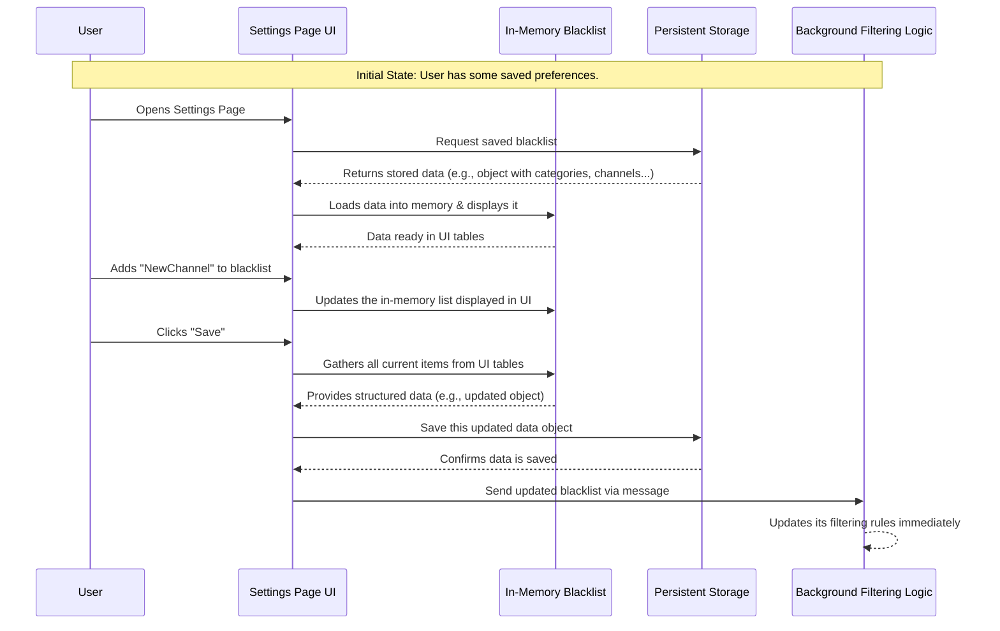

# Chapter 1: Blacklist Data Model

Welcome to the UnwantedTwitch tutorial! We're excited to guide you through how this browser extension works, piece by piece. Let's start with the very foundation: the data.

Imagine you're watching Twitch, and you decide you *really* don't want to see streams in the "ASMR" category anymore. You also want to hide a specific channel, say "NoisyStreamer". How does the extension remember these preferences? Where does it keep this list of things to hide?

This is where the **Blacklist Data Model** comes in. Think of it as the extension's digital "naughty list" or your personal "do not show me this" list for Twitch. It's the core set of instructions you give the extension about what content to filter out.

## What is the Blacklist Data Model?

At its heart, the Blacklist Data Model is simply a structured way to store all the items you've decided to blacklist. It needs to hold different *types* of items because you might want to hide things based on:

1.  **Categories:** Like "Slots", "ASMR", or "Pools, Hot Tubs & Bikinis".
2.  **Channels:** Specific streamer channels you don't want to see, e.g., "AnnoyingBotChannel".
3.  **Tags:** Twitch tags used to describe streams, like "DropsEnabled" or "Competitive".
4.  **Title Keywords:** Words or phrases appearing in stream titles, such as "giveaway" or "24/7".

The data model keeps these lists organized, usually separating them by type.

## Why Structure the Data?

Why not just have one long list? Structuring the data (like putting items into labeled boxes: one for categories, one for channels, etc.) makes it easier and faster for the extension to:

*   **Load:** Quickly read your preferences when the browser starts or the extension is enabled.
*   **Display & Modify:** Show your current blacklist clearly in the settings page and allow you to add or remove items easily. (We'll cover the user interface in [Chapter 2: Settings Page Manager (Blacklist UI)](02_settings_page_manager__blacklist_ui_.md)).
*   **Save:** Store your preferences persistently so they aren't forgotten when you close your browser.
*   **Filter:** Efficiently check if a stream's category, channel, tag, or title matches any item on your blacklist. (The details of matching are in [Chapter 4: Blacklist Term Matching Logic](04_blacklist_term_matching_logic_.md)).

## A Simple Example Structure

Imagine the data model as a simple JavaScript object. It might look something like this internally:

```javascript
// A simplified view of the blacklist data
let blacklistData = {
  categories: {
    "ASMR": 1,
    "Slots": 1
    // More categories...
  },
  channels: {
    "NoisyStreamer": 1,
    "SpamBot123": 1
    // More channels...
  },
  tags: {
    "Gambling": 1
    // More tags...
  },
  titles: [
    "exclusive giveaway", // Hide titles containing this exact phrase
    "/^24\\/7 stream/i"  // Hide titles starting with "24/7 stream" (case-insensitive)
    // More title patterns...
  ]
};
```

**Explanation:**

*   We have keys like `categories`, `channels`, `tags`, and `titles`.
*   For `categories`, `channels`, and `tags`, we often use an object (like a dictionary or map) where the key is the item to hide (e.g., "ASMR"). The value (`1` here) doesn't matter much; its presence indicates the item is blacklisted. This allows for very fast checking: "Is 'ASMR' in the blacklist?".
*   For `titles`, we often use an array (a simple list) because title matching can be more complex, sometimes involving patterns or case-insensitivity (we'll explore this in [Chapter 4: Blacklist Term Matching Logic](04_blacklist_term_matching_logic_.md)).

This structure holds all the information the extension needs to do its job.

## How the Data Model is Used: Loading and Saving

The extension constantly interacts with this data model. Two key moments are loading and saving.

**1. Loading the Blacklist:**

When the extension starts (or when you open the settings page), it needs to load your previously saved blacklist.

```javascript
// Simplified from scripts/blacklist.js - loadBlacklistedItems

async function loadBlacklistedItems() {
  // 1. Ask the storage system for the saved blacklist data.
  //    'storageGet' is a helper function we'll see more in
  //    [Chapter 6: Storage Abstraction & Mode Handling](06_storage_abstraction___mode_handling_.md)
  const result = await storageGet('blacklistedItems'); // Or fragmented keys

  let blacklistedItems = {};
  // (Code here handles potentially fragmented data - see Chapter 7)
  if (typeof result.blacklistedItems === 'object') {
    blacklistedItems = result.blacklistedItems;
  } else {
    // ... logic to merge fragments ...
    console.log("Loaded blacklist from fragments.");
  }

  // 2. Populate the UI tables with the loaded items.
  //    'addItems' takes the loaded data and displays it.
  addItems(categories_table_element, blacklistedItems.categories);
  addItems(channels_table_element, blacklistedItems.channels);
  addItems(tags_table_element, blacklistedItems.tags);
  addItems(titles_table_element, blacklistedItems.titles);

  console.log("Blacklist loaded and displayed.");
  // ... also load other settings like hideFollowing, hideReruns ...
}

// Assume categories_table_element etc. are references to HTML table bodies
const categories_table_element = document.getElementById('table_categories').querySelector('tbody');
// ... similarly for channels, tags, titles ...

// Call the function to load data when the settings page opens
loadBlacklistedItems();
```

**Explanation:**

*   The code first asks the browser's storage for the saved blacklist using `storageGet`. We'll learn more about `storageGet` and where the data is actually kept in [Chapter 6: Storage Abstraction & Mode Handling](06_storage_abstraction___mode_handling_.md) and [Chapter 7: Storage Fragmentation Strategy](07_storage_fragmentation_strategy_.md).
*   It then takes the loaded `blacklistedItems` object and uses helper functions (like `addItems` from `scripts/blacklist.js`) to display these items in the settings page tables.

**2. Saving the Blacklist:**

When you make changes in the settings (add or remove items) and click "Save", the extension needs to gather the current state of your lists and save it.

```javascript
// Simplified from scripts/blacklist.js - onSave

async function onSave() {
  // (Code here saves other settings like hideFollowing, useSyncStorage...)

  // 1. Gather the current items from the UI tables.
  //    'gatherKeysMap' and 'gatherKeysArray' read the items displayed
  //    in the settings page tables.
  let itemsToSave = {
    categories: gatherKeysMap(categories_table_element), // e.g., {"ASMR": 1, "Slots": 1}
    channels:   gatherKeysMap(channels_table_element),   // e.g., {"NoisyStreamer": 1}
    tags:       gatherKeysMap(tags_table_element),       // e.g., {"Gambling": 1}
    titles:     gatherKeysArray(titles_table_element)  // e.g., ["giveaway", "/^24\\/7/i"]
  };

  // 2. Tell the background process about the updated list immediately.
  //    This ensures filtering reflects changes right away.
  //    We'll learn about messaging in [Chapter 5: Background Event Handler & Message Router](05_background_event_handler___message_router_.md).
  try {
    await chrome.runtime.sendMessage({ 'blacklistedItems': itemsToSave });
    console.log("Sent updated blacklist to background.");
  } catch (error) {
    console.error("Error sending message:", error);
  }

  // 3. Save the data persistently using the storage system.
  //    (Saving might involve splitting into fragments - see Chapter 7)
  await storageSet({ 'blacklistedItems': itemsToSave }); // Simplified - actual save handles fragmentation
  console.log("Blacklist saved to storage.");

  // (Code here might close the settings tab)
}

// Helper functions (simplified concept)
function gatherKeysMap(tableElement) { /* Reads items from table rows into an object */ return {}; }
function gatherKeysArray(tableElement) { /* Reads items from table rows into an array */ return []; }
```

**Explanation:**

*   The code first uses functions like `gatherKeysMap` and `gatherKeysArray` to collect all the items currently listed in the settings page tables. This creates an object (`itemsToSave`) matching our data model structure.
*   It then sends this updated list to the extension's background process using `chrome.runtime.sendMessage`. This is important so that the part of the extension actively filtering Twitch content gets the latest list immediately. This communication is handled by the [Chapter 5: Background Event Handler & Message Router](05_background_event_handler___message_router_.md).
*   Finally, it uses `storageSet` (from [Chapter 6: Storage Abstraction & Mode Handling](06_storage_abstraction___mode_handling_.md)) to save the `itemsToSave` object persistently.

## Under the Hood: Data Flow

Let's visualize the basic flow of loading and saving the blacklist data:



This diagram shows how the Settings Page acts as an intermediary: it fetches data from Storage to populate the Data Model (shown in the UI), allows the User to modify it, and then pushes the updated Data Model back to Storage and notifies the Background process.

## Conclusion

The Blacklist Data Model is the backbone of UnwantedTwitch. It's the structured representation of *what* you want to hide. We've seen:

*   It holds lists of categories, channels, tags, and title keywords/patterns.
*   It needs to be loaded when the extension starts or settings are opened.
*   It needs to be saved persistently when you make changes.
*   Other parts of the extension rely on this data to perform filtering.

Understanding this data structure is the first step. Now that we know *what* data we're working with, let's dive into *how* the user interacts with it.

**Next:** [Chapter 2: Settings Page Manager (Blacklist UI)](02_settings_page_manager__blacklist_ui_.md)

---

Generated by [AI Codebase Knowledge Builder](https://github.com/The-Pocket/Tutorial-Codebase-Knowledge)