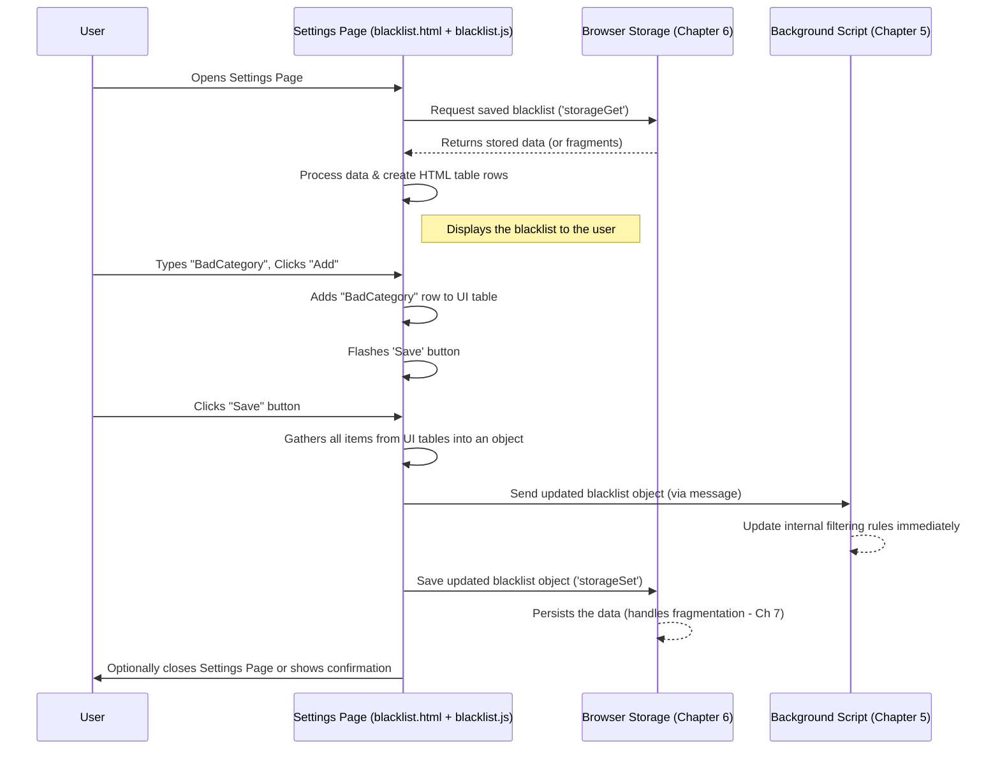

# Chapter 2: Settings Page Manager (Blacklist UI)

Welcome back! In [Chapter 1: Blacklist Data Model](01_blacklist_data_model_.md), we learned *what* kind of information UnwantedTwitch stores – your personal "do not show me this" list for Twitch, containing categories, channels, tags, and title keywords. That's great, but how do you actually *see* that list? How do you add new items or remove old ones?

This is where the **Settings Page Manager** comes in. Think of it as the friendly librarian for your blacklist. The actual list (the data model) is like the library's collection of books, carefully organized. The Settings Page Manager is the librarian who helps you:

*   Find the books (loads your current blacklist from storage).
*   Browse the catalog (displays the list clearly on the settings page).
*   Check out new books (handles you adding new items).
*   Return books (handles you removing items).
*   Update the library records (prepares the updated list to be saved).

It manages the user interface you see on the `views/blacklist.html` page, making it easy for you to interact with your blacklist data.

## What Does the Settings Page Manager Do?

Its main job is to connect the user interface (what you see and click) with the stored data (your blacklist). It has several key responsibilities:

1.  **Loading Data:** When you open the settings page, the manager fetches your saved blacklist (categories, channels, tags, titles) and other settings (like "Hide Following") from the browser's storage.
2.  **Displaying Data:** It takes the loaded data and neatly populates the tables you see on the settings page, listing all your currently blacklisted items.
3.  **Handling User Actions:** This is a big one! It listens for your clicks and inputs:
    *   **Adding:** When you type something into an input box (e.g., a channel name) and click "Add", it takes that input, processes it slightly (like trimming spaces), and adds it to the correct list displayed on the page.
    *   **Removing:** When you click the "Remove" button next to an item, it removes that item's row from the table.
    *   **Toggling:** When you check or uncheck boxes like "Hide Following" or "Use Sync Storage", it registers that change.
    *   **Import/Export:** It handles the logic for importing a blacklist from a file or exporting your current list to a file.
4.  **Preparing Data for Saving:** When you click "Save", the manager gathers *all* the items currently displayed in the tables and the state of the checkboxes, organizes them back into the structured format we saw in Chapter 1, and gets them ready to be saved.

Essentially, it's the bridge between you, the visual settings page, and the underlying data storage.

## How It Works: A User's Journey

Let's walk through a typical interaction:

1.  **You Open Settings:** You click the extension icon and choose "Settings". This opens the `views/blacklist.html` page.
2.  **Loading Happens:** Behind the scenes, the Settings Page Manager code (mainly in `scripts/blacklist.js`) immediately asks the storage system for your saved blacklist and settings. (We'll cover storage in detail in [Chapter 6: Storage Abstraction & Mode Handling](06_storage_abstraction___mode_handling_.md)).
3.  **List Appears:** The manager receives the data and dynamically creates the rows in the tables to show your current blacklist (e.g., "ASMR" under Categories, "NoisyStreamer" under Channels). It also sets the checkboxes correctly.
4.  **You Add an Item:** You type "Just Chatting" into the Categories input box and click "Add".
5.  **UI Updates:** The manager's code detects the click, grabs "Just Chatting", creates a new row for it in the Categories table, and adds it to the display. It also subtly hints that changes haven't been saved yet (maybe by making the "Save" button flash or change color).
6.  **You Click Save:** You've finished making changes and click the "Save" button.
7.  **Saving Happens:** The manager's code now:
    *   Goes through each table and collects all the items listed (including "Just Chatting").
    *   Collects the status of the checkboxes.
    *   Packages all this information into a structured object (like the `blacklistData` example from Chapter 1).
    *   Tells the background part of the extension about the immediate update (covered in [Chapter 5: Background Event Handler & Message Router](05_background_event_handler___message_router_.md)).
    *   Tells the storage system to save this updated package permanently. (Saving might involve breaking large lists into smaller pieces, as discussed in [Chapter 7: Storage Fragmentation Strategy](07_storage_fragmentation_strategy_.md)).
    *   Maybe closes the settings page.

## Code Examples: A Glimpse Under the Hood

Let's look at simplified snippets from `scripts/blacklist.js` to see how some of these steps are coded.

**1. Loading and Displaying Items:**

When the settings page opens, something like this happens:

```javascript
// Simplified from loadBlacklistedItems in scripts/blacklist.js

// Get references to the places in the HTML where lists are shown
const categories_table_element = document.getElementById('table_categories').querySelector('tbody');
// ... similarly for channels, tags, titles ...

async function loadAndDisplayData() {
  console.log("Asking storage for saved blacklist...");
  // Ask storage for the data (more on storageGet in Chapter 6)
  const result = await storageGet('blacklistedItems'); // Might get fragmented data too

  // Process the result (handle fragments if necessary - Chapter 7)
  let blacklistedItems = processLoadedData(result);

  console.log("Displaying items in tables...");
  // Use helper functions to put items into the HTML tables
  addItems(categories_table_element, blacklistedItems.categories);
  addItems(channels_table_element, blacklistedItems.channels);
  // ... add items for tags and titles ...

  // ... also load checkbox settings ...
  console.log("Blacklist loaded and displayed!");
}

// Helper to display multiple items (Simplified from addItems)
function addItems(tableElement, itemsObject) {
  // If itemsObject is { "ASMR": 1, "Slots": 1 }
  for (const key in itemsObject) {
    // Create a new row for each item (e.g., for "ASMR")
    const newRow = createItemRow(key);
    // Add the row to the table in the HTML
    tableElement.appendChild(newRow);
  }
  // Update the item count display (e.g., "(2)")
  updateItemCount(tableElement);
}

// Helper to create one row (Simplified from createItemRow)
function createItemRow(itemText) {
  // Creates HTML like: <tr><td>ASMR</td><td><button>Remove</button></td></tr>
  const row = document.createElement('tr');
  // ... create cells, add itemText, create remove button ...
  // ... attach event listener to the remove button ...
  console.log(`Created row for: ${itemText}`);
  return row;
}

// Start loading when the page is ready
loadAndDisplayData();
```

*   **Input:** `storageGet` fetches the stored blacklist object.
*   **Output:** The `addItems` and `createItemRow` functions dynamically generate HTML table rows based on the fetched data, making your blacklist visible on the page.

**2. Handling User Adding an Item:**

When you type and click "Add":

```javascript
// Simplified from onAddItem in scripts/blacklist.js

function handleAddItemClick(buttonElement) {
  // Find the input box associated with this button
  const inputElement = buttonElement.closest('tr').querySelector('input');
  const tableElement = buttonElement.closest('table').querySelector('tbody');

  // Get the text, remove extra spaces
  let newItem = inputElement.value.trim();

  if (newItem.length > 0) {
    console.log(`User wants to add: ${newItem}`);
    // Add the item to the table display
    const added = addItemToTable(tableElement, newItem);
    if (added) {
      inputElement.value = ''; // Clear the input box
      flashSaveButton(); // Signal that changes need saving
    } else {
      alert(`${newItem} is already in the list!`);
    }
  }
  inputElement.focus(); // Put the cursor back in the input box
}

// Helper to add a single item visually (Simplified from addItem)
function addItemToTable(tableElement, itemText) {
  // Check if item already exists (simplified)
  if (itemExistsInTable(tableElement, itemText)) {
    return false; // Don't add duplicates
  }
  const newRow = createItemRow(itemText); // Use the helper from before
  tableElement.insertBefore(newRow, tableElement.firstChild.nextSibling); // Add near top
  updateItemCount(tableElement); // Update count display
  return true;
}
```

*   **Input:** The text typed by the user in an input field (e.g., "Just Chatting").
*   **Output:** A new row containing "Just Chatting" appears in the corresponding table on the page, and the input box is cleared. The "Save" button might start flashing.

**3. Preparing Data for Saving:**

When you click "Save":

```javascript
// Simplified from onSave in scripts/blacklist.js

async function prepareAndSaveData() {
  console.log("Save button clicked. Gathering data...");

  // 1. Gather items from the UI tables
  let dataToSave = {
    categories: gatherItemsFromTable_Map(categories_table_element), // -> {"ASMR": 1, "Slots": 1, "Just Chatting": 1}
    channels:   gatherItemsFromTable_Map(channels_table_element),   // -> {"NoisyStreamer": 1}
    tags:       gatherItemsFromTable_Map(tags_table_element),       // -> {} (empty in this example)
    titles:     gatherItemsFromTable_Array(titles_table_element)    // -> ["giveaway", "/^win/i"]
  };

  // ... also gather checkbox states ...

  console.log("Data gathered:", dataToSave);

  // 2. Send immediate update to background script (Chapter 5)
  try {
    await chrome.runtime.sendMessage({ 'blacklistedItems': dataToSave });
    console.log("Sent update to background.");
  } catch (error) { /* Handle error */ }

  // 3. Save persistently to storage (Chapter 6 & 7)
  await storageSet({ 'blacklistedItems': dataToSave }); // Simplified - actual save handles fragments
  console.log("Data sent to storage for saving.");

  // 4. Maybe close the settings tab
  // closeSettingsTab();
}

// Helper to get items from a table into an object { key: 1 }
function gatherItemsFromTable_Map(tableElement) {
  let itemsMap = {};
  const rows = tableElement.querySelectorAll('tr.item'); // Get all item rows
  rows.forEach(row => {
    const key = row.cells[0].textContent; // Get text from first cell
    itemsMap[key] = 1;
  });
  return itemsMap;
}
// Helper to get items from a table into an array ["item1", "item2"]
function gatherItemsFromTable_Array(tableElement) { /* Similar logic, but returns array */ return []; }
```

*   **Input:** The current state of the HTML tables (which rows exist).
*   **Output:** A structured JavaScript object (`dataToSave`) is created, matching the format needed for storage and filtering. This object is then sent to the background script and the storage system.

## Internal Flow: Loading and Saving Visualized

Let's visualize the key interactions managed by the Settings Page code:



This diagram shows the Settings Page Manager (`SettingsUI`) acting as the central coordinator: fetching from `Storage`, updating the display for the `User`, handling `User` input, and pushing updates back to the `Background` script and `Storage`.

## Conclusion

The Settings Page Manager is the crucial link that lets you, the user, control your blacklist. It takes the abstract data model from Chapter 1 and makes it tangible and interactive through the `views/blacklist.html` page. We've seen how it:

*   Loads and displays your current blacklist.
*   Responds to your actions like adding or removing items.
*   Gathers your changes and prepares them for saving.
*   Coordinates with storage and the background filtering process.

It acts as the "librarian," providing the interface to manage your personal collection of unwanted Twitch content.

Now that we understand how the main settings page works, what about making quick changes without opening the full page?

**Next:** [Chapter 3: Popup Controller](03_popup_controller_.md) - Learn how the small popup window you access from the browser toolbar lets you quickly add the current channel or category to your blacklist.

---

Generated by [AI Codebase Knowledge Builder](https://github.com/The-Pocket/Tutorial-Codebase-Knowledge)