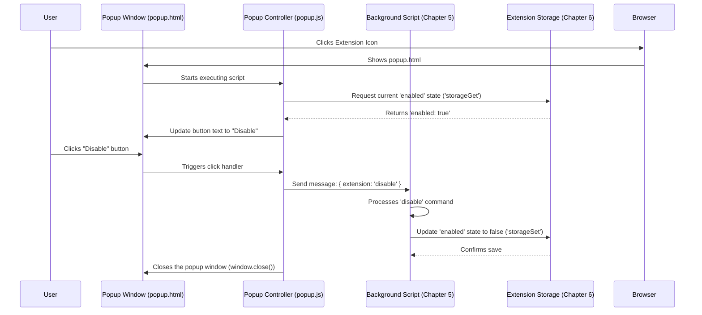

# Chapter 3: Popup Controller

In [Chapter 2: Settings Page Manager (Blacklist UI)](02_settings_page_manager__blacklist_ui_.md), we saw how the main settings page lets you manage your detailed blacklist. But what if you just want to quickly turn the *entire* extension on or off, or maybe hide those little filter buttons that appear on Twitch pages, without digging into the full settings?

That's where the **Popup Controller** comes in! Think of it as the extension's handy little remote control.

## What's the Problem? Quick Access is Key!

Imagine you're browsing Twitch, and for a moment, you want to see *everything* unfiltered. Or maybe you just installed the extension and want to quickly enable it. Going to the full settings page (`blacklist.html`) feels like too many clicks for such simple actions.

We need a way to access the most essential controls instantly, right from the browser toolbar.

## The Solution: The Popup Window

Most browser extensions have an icon you can click in your browser's toolbar. When you click the UnwantedTwitch icon, a small window "pops up" – this is the popup! The **Popup Controller** is the JavaScript code (`scripts/popup.js`) that brings this little window to life and makes its buttons work.

It provides quick access to:

1.  **Enable/Disable the Extension:** A master switch to turn all filtering on or off globally.
2.  **Toggle Filter Button Visibility:** Controls whether the "+" and "-" buttons appear next to categories, channels, etc., on Twitch pages (these buttons are added by other parts of the extension, called content scripts).
3.  **Open Full Settings:** A shortcut button to take you directly to the main [Settings Page Manager (Blacklist UI)](02_settings_page_manager__blacklist_ui_.md).

It's like the remote for your TV – you don't use it to fine-tune the picture settings (that's the main settings menu), but you use it all the time to turn the TV on/off or change the channel (quick actions).

## How It Works: Using the Remote Control

Let's see how you'd use the popup and what the Popup Controller does behind the scenes:

1.  **Click the Icon:** You click the UnwantedTwitch icon in your browser toolbar.
2.  **Popup Appears:** The browser opens the small `views/popup.html` window.
3.  **Controller Wakes Up:** The `scripts/popup.js` code starts running inside that popup.
4.  **Gets Current Status:** The first thing the script does is ask the extension's memory (via the storage system) "Is the extension currently enabled?" and "Are filter buttons currently set to show?". We'll learn how it asks storage in [Chapter 6: Storage Abstraction & Mode Handling](06_storage_abstraction___mode_handling_.md).
5.  **Updates the Look:** Based on the answers it gets, the script adjusts the popup's appearance. If the extension is enabled, the main button might say "Disable Extension" and look active. If disabled, it might say "Enable Extension". The checkbox for filter buttons will be checked or unchecked accordingly.
6.  **You Click a Button:** Let's say you click the "Disable Extension" button.
7.  **Sends a Command:** The Popup Controller doesn't disable the extension *itself*. Instead, it sends a message, like sending a command over a walkie-talkie, to the main brain of the extension (the background script). The message says, "Hey, the user wants to disable the extension!" We'll learn about this messaging in [Chapter 5: Background Event Handler & Message Router](05_background_event_handler___message_router_.md).
8.  **Background Acts:** The background script receives the message and performs the actual action of disabling the filtering.
9.  **Popup Closes:** Often, clicking an action button in the popup also closes the popup window automatically.

## Code Examples: A Peek Inside `popup.js`

Let's look at simplified code snippets to understand these steps better.

**1. Getting the Current State When the Popup Opens:**

When `popup.html` loads, `popup.js` needs to know the current settings to display them correctly.

```javascript
// Simplified from init() and getState() in scripts/popup.js

async function initializePopupState() {
  console.log("Popup opened, getting current state...");

  // Ask storage for 'enabled' and 'renderButtons' status
  // storageGet is our helper for accessing stored data (Chapter 6)
  const result = await storageGet(['enabled', 'renderButtons']);

  let isEnabled = result.enabled !== false; // Default to true if undefined
  let showButtons = result.renderButtons !== false; // Default to true

  console.log("State received:", { isEnabled, showButtons });

  // Update the buttons and checkboxes based on the state
  updateEnableDisableButton(isEnabled);
  updateShowButtonsCheckbox(showButtons);
}

// Helper to update the main toggle button's text and look
function updateEnableDisableButton(enabled) {
  const button = document.getElementById('toggle_extension');
  if (enabled) {
    button.textContent = "Disable Extension"; // Or localized text
    button.className = 'enabled'; // Style it as enabled
  } else {
    button.textContent = "Enable Extension"; // Or localized text
    button.className = 'disabled'; // Style it as disabled
  }
}

// Helper to update the checkbox state
function updateShowButtonsCheckbox(show) {
  const checkbox = document.getElementById('toggle_buttons');
  checkbox.checked = show;
}

// Run this initialization when the popup loads
initializePopupState();
```

*   **Input:** The popup opens.
*   **Action:** The code calls `storageGet` to fetch the current `enabled` and `renderButtons` values from where the extension stores its settings ([Chapter 6: Storage Abstraction & Mode Handling](06_storage_abstraction___mode_handling_.md)).
*   **Output:** The main button's text ("Enable" or "Disable") and the checkbox's checked state are updated to reflect the current reality.

**2. Handling the Enable/Disable Button Click:**

When the user clicks the main toggle button.

```javascript
// Simplified from toggleExtension() in scripts/popup.js

function handleToggleExtensionClick() {
  const button = document.getElementById('toggle_extension');
  let command = '';

  // Check the button's current state to decide the command
  if (button.classList.contains('enabled')) {
    console.log("User clicked 'Disable Extension'");
    command = 'disable';
  } else {
    console.log("User clicked 'Enable Extension'");
    command = 'enable';
  }

  // Send a message to the background script (Chapter 5)
  chrome.runtime.sendMessage({ 'extension': command })
    .then(() => console.log(`Sent '${command}' command.`))
    .catch(error => console.error("Error sending command:", error));

  // Close the popup window
  window.close();
}

// Find the button and tell it to run our function when clicked
const stateToggleButton = document.getElementById('toggle_extension');
stateToggleButton.addEventListener('click', handleToggleExtensionClick);
```

*   **Input:** The user clicks the Enable/Disable button.
*   **Action:** The code determines whether to send an "enable" or "disable" command based on the button's current appearance. It then uses `chrome.runtime.sendMessage` to send this command to the background script ([Chapter 5: Background Event Handler & Message Router](05_background_event_handler___message_router_.md)).
*   **Output:** A message is sent to the background script, and the popup closes. The background script will handle the actual enabling/disabling.

**3. Handling the "Show Filter Buttons" Checkbox Change:**

When the user checks or unchecks the box.

```javascript
// Simplified from toggleButtonsToggle() in scripts/popup.js

function handleToggleButtonsChange() {
  const checkbox = document.getElementById('toggle_buttons');
  const shouldRender = checkbox.checked; // true if checked, false if not

  console.log(`User set 'Show Filter Buttons' to: ${shouldRender}`);

  // Send a message to the background script (Chapter 5)
  chrome.runtime.sendMessage({ 'renderButtons': shouldRender })
    .then(() => console.log(`Sent renderButtons=${shouldRender} command.`))
    .catch(error => console.error("Error sending command:", error));

  // No need to close the popup for checkbox changes usually
}

// Find the checkbox and tell it to run our function when its state changes
const buttonsToggleButton = document.getElementById('toggle_buttons');
buttonsToggleButton.addEventListener('change', handleToggleButtonsChange);
```

*   **Input:** The user clicks the checkbox, changing its state.
*   **Action:** The code gets the new state (`true` or `false`) from the checkbox. It sends a message to the background script ([Chapter 5: Background Event Handler & Message Router](05_background_event_handler___message_router_.md)) indicating the user's preference for `renderButtons`.
*   **Output:** A message is sent to the background script. The background script will likely save this preference and might need to tell content scripts on Twitch pages to update.

**4. Opening the Full Settings Page:**

```javascript
// Simplified from openBlacklist() in scripts/popup.js

function handleOpenBlacklistClick() {
  console.log("User clicked 'Manage Blacklist'");
  // Use the browser's API to open a new tab with our settings page
  chrome.tabs.create({ url: '/views/blacklist.html' });

  // Close the popup window
  window.close();
}

// Find the button and link it to our function
const blacklistManagerButton = document.getElementById('open_blacklist');
blacklistManagerButton.addEventListener('click', handleOpenBlacklistClick);
```

*   **Input:** User clicks the "Manage Blacklist" button.
*   **Action:** The code uses `chrome.tabs.create` to open the main `blacklist.html` page in a new browser tab.
*   **Output:** The full settings page opens, and the popup closes.

## Internal Flow: Behind the Remote Control

Let's visualize the typical flow when you use the popup to disable the extension:



This shows the Popup Controller (`PopupJS`) acting as a messenger. It reads the initial state from `Storage`, displays it in the `PopupUI`, and when the `User` interacts, it sends commands to the `Background` script, which does the real work and updates the `Storage`.

## Conclusion

The Popup Controller provides a vital function: quick and easy access to essential extension controls right from the browser toolbar. It acts like a simple remote control, allowing you to:

*   Quickly enable or disable the entire extension.
*   Toggle the visibility of filter buttons on Twitch pages.
*   Easily jump to the full settings page.

It achieves this by reading the current state, displaying it, and sending messages to the background script when you interact with the controls. It keeps things simple for common tasks.

Now that we've seen the main settings UI and the quick-access popup, how does the extension actually decide *if* a stream should be hidden based on your blacklist?

**Next:** [Chapter 4: Blacklist Term Matching Logic](04_blacklist_term_matching_logic_.md) - Dive into the core logic that compares stream details against your blacklist rules.

---

Generated by [AI Codebase Knowledge Builder](https://github.com/The-Pocket/Tutorial-Codebase-Knowledge)