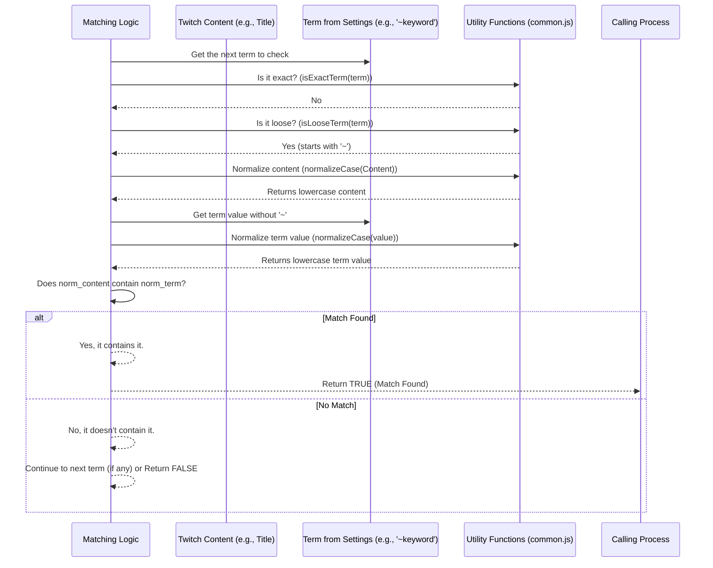

# Chapter 4: Blacklist Term Matching Logic

Hi again! In the last chapter, [Chapter 3: Popup Controller](03_popup_controller_.md), we saw how the little popup window gives you quick access to basic controls. Before that, in [Chapter 2: Settings Page Manager (Blacklist UI)](02_settings_page_manager__blacklist_ui_.md), we learned how to add items to your blacklist using the main settings page.

Now, let's connect the dots. You've added "ASMR" to your category blacklist. Later, you're browsing Twitch, and the extension sees a stream in the "ASMR" category. How does it *know* that "ASMR" (all caps) should be blocked because you typed "asmr" (all lowercase) in the settings? What if you only want to block the *exact* phrase "Exclusive Giveaway" but not just "giveaway"?

This is where **Blacklist Term Matching Logic** comes in. It's the set of rules the extension uses to decide if a piece of Twitch content (like a category name, channel name, tag, or stream title) matches an item on your blacklist. Think of it as defining *how specific* your filter should be.

## Why Different Rules? One Size Doesn't Fit All!

Imagine you just want to block any stream with "giveaway" in the title. You wouldn't want to add "giveaway", "Giveaway", "GIVEAWAY", "big giveaway", "awesome giveaway stream" etc., separately! That would be tedious.

You need different ways to tell the extension *how* to interpret your blacklist entries:

1.  **Sometimes you want a simple, case-insensitive match:** "asmr" should block "ASMR", "AsMr", etc.
2.  **Sometimes you want to match *part* of a phrase:** "slots" should maybe block titles like "Playing slots all day!".
3.  **Sometimes you need very precise, case-sensitive matching:** Maybe you want to block `'SpecificAnnoyingBot'` but *not* `'specificannoyingbot'` (though this is less common).
4.  **Sometimes you need complex pattern matching:** Maybe you want to block any title that mentions a year between 2020 and 2024.

The Term Matching Logic provides different syntaxes (ways of writing your blacklist terms) to handle these cases.

## The Different Ways to Match: Understanding the Syntax

UnwantedTwitch uses special characters at the beginning or around your blacklist terms to tell it which matching rule to apply. Let's look at the main types you can enter in the settings page:

**1. Default Match (Simple, Case-Insensitive, Exact-ish)**

*   **Syntax:** Just type the word or phrase, like `ASMR` or `Just Chatting`.
*   **How it works:** When you save, the extension usually converts your term to lowercase (e.g., `ASMR` becomes `asmr`). When checking Twitch content, it also converts the content to lowercase. It then checks if they are *exactly the same* after conversion.
*   **Example:**
    *   Blacklist term: `ASMR` (saved as `asmr`)
    *   Twitch category: `ASMR` (checked as `asmr`) -> **MATCH!**
    *   Twitch category: `AsMr` (checked as `asmr`) -> **MATCH!**
    *   Twitch category: `ASMR Relaxing Sounds` (checked as `asmr relaxing sounds`) -> **NO MATCH** (because it's not exactly `asmr`)
*   **Use Case:** Best for blocking exact categories, channels, or tags where you don't care about capitalization.

**2. Exact Match (Case-Sensitive)**

*   **Syntax:** Put the term in single quotes, like `'SpecificStreamer'`.
*   **How it works:** The extension looks for an *exact* match, including capitalization. The single quotes are *not* part of the match itself.
*   **Example:**
    *   Blacklist term: `'SpecificStreamer'`
    *   Twitch channel: `SpecificStreamer` -> **MATCH!**
    *   Twitch channel: `specificstreamer` -> **NO MATCH**
    *   Twitch channel: `SpecificStreamer123` -> **NO MATCH**
*   **Use Case:** When you need to be very precise about capitalization, which is quite rare.

**3. Loose Match (Case-Insensitive, Contains)**

*   **Syntax:** Start the term with a tilde (`~`), like `~giveaway`.
*   **How it works:** The extension converts both your term (without the `~`) and the Twitch content to lowercase. It then checks if the Twitch content *contains* your term anywhere within it.
*   **Example:**
    *   Blacklist term: `~giveaway` (checked as `giveaway`)
    *   Twitch title: `Big Giveaway Stream!` (checked as `big giveaway stream!`) -> **MATCH!** (contains `giveaway`)
    *   Twitch title: `No giveaways here` (checked as `no giveaways here`) -> **MATCH!** (contains `giveaway`)
    *   Twitch title: `Playing Games` (checked as `playing games`) -> **NO MATCH**
*   **Use Case:** Great for blocking stream titles that mention a certain keyword, regardless of other words around it or capitalization.

**4. Regular Expression Match (Advanced)**

*   **Syntax:** Enclose a pattern in forward slashes (`/`), like `/card game/i`.
*   **How it works:** This uses a powerful pattern-matching language called Regular Expressions (RegEx). The `/.../` tells the extension it's a regex pattern. An optional `i` at the end makes the match case-insensitive.
*   **Example:**
    *   Blacklist term: `/card game/i`
    *   Twitch title: `Playing a new Card Game` -> **MATCH!** (case-insensitive match for "card game")
    *   Twitch title: `My cardgame deck` -> **NO MATCH** (needs the space)
    *   Blacklist term: `/^\[(AD|PROMO)\]/` (Matches titles starting with `[AD]` or `[PROMO]`)
    *   Twitch title: `[AD] Sponsored Stream!` -> **MATCH!**
    *   Twitch title: `My Awesome Stream [PROMO]` -> **NO MATCH** (doesn't start with it)
*   **Use Case:** For complex patterns that simple text matching can't handle. This is for advanced users; learning regex takes time!

## How is the Logic Applied? Checking Content

Imagine the extension is looking at a stream with the title "Big Giveaway! Win Prizes!". Your blacklist contains `~giveaway` and `Slots`. Here's a simplified idea of what happens:

```javascript
// Simplified concept of checking content against the blacklist

function doesContentMatchBlacklist(content, blacklistTerms) {
  // First, make a lowercase version of the content for comparison
  let normalizedContent = normalizeCase(content); // e.g., "big giveaway! win prizes!"

  // Go through each term in the blacklist
  for (const term of blacklistTerms) {
    // Check the format of the term to decide how to compare

    if (isExactTerm(term)) { // Does it start/end with ' ?
      // Remove the quotes: 'Specific' -> Specific
      let exactTerm = term.substring(1, term.length - 1);
      if (content === exactTerm) { // Case-sensitive comparison
        console.log(`Exact match found: ${content} == ${term}`);
        return true; // Found a match, stop checking
      }
    } else if (isLooseTerm(term)) { // Does it start with ~ ?
      // Remove the tilde and normalize: ~giveaway -> giveaway
      let looseTerm = normalizeCase(term.substring(1));
      if (normalizedContent.includes(looseTerm)) { // Case-insensitive 'contains' check
        console.log(`Loose match found: ${content} contains ${term}`);
        return true; // Found a match
      }
    } else if (isRegExpTerm(term)) { // Does it look like /pattern/i ?
      let regex = toRegExp(term); // Convert string to actual RegExp object
      if (regex && regex.test(content)) { // Use RegExp matching
        console.log(`Regex match found: ${content} matches ${term}`);
        return true; // Found a match
      }
    } else { // Default match
      // Assume the term is already normalized (lowercase) from when it was saved
      let defaultTerm = term; // e.g., 'slots'
      if (normalizedContent === defaultTerm) { // Case-insensitive exact compare
        console.log(`Default match found: ${content} == ${term}`);
        return true; // Found a match
      }
    }
  }

  // If we checked all terms and found no match
  return false;
}

// --- Helper functions (from scripts/common.js, simplified) ---
function normalizeCase(text) { return text.toLowerCase(); /* Simplified */ }
function isExactTerm(term) { return term.startsWith("'") && term.endsWith("'"); }
function isLooseTerm(term) { return term.startsWith("~"); }
function isRegExpTerm(term) { return term.startsWith("/") && term.includes("/", 1); }
function toRegExp(term) { /* Tries to create RegExp object, returns null on error */ }

// --- Example Usage ---
let streamTitle = "Big Giveaway! Win Prizes!";
let titleBlacklist = ["~giveaway", "slots"]; // Example blacklist

if (doesContentMatchBlacklist(streamTitle, titleBlacklist)) {
  console.log("Stream title is blacklisted!");
  // Code to hide the stream would run here
} else {
  console.log("Stream title is OK.");
}
```

**Explanation:**

1.  The `doesContentMatchBlacklist` function takes the content (e.g., stream title) and the list of relevant blacklist terms.
2.  It converts the content to lowercase (`normalizeCase`) for easy comparison.
3.  It loops through each `term` in the `blacklistTerms`.
4.  Inside the loop, it uses helper functions (`isExactTerm`, `isLooseTerm`, `isRegExpTerm`) to check the *format* of the blacklist term.
5.  Based on the format, it performs the correct type of comparison:
    *   `'...'`: Exact, case-sensitive (`===`).
    *   `~...`: Case-insensitive `contains` (`.includes()` on lowercase strings).
    *   `/.../`: Regular expression matching (`regex.test()`).
    *   Default: Case-insensitive exact match (`===` on lowercase strings).
6.  If any comparison returns `true`, the function immediately stops and returns `true` (the content is blacklisted).
7.  If the loop finishes without finding any match, the function returns `false`.

In our example `doesContentMatchBlacklist("Big Giveaway! Win Prizes!", ["~giveaway", "slots"])`:
*   It checks `~giveaway`. `isLooseTerm` is true.
*   It compares if `"big giveaway! win prizes!"` (normalized content) includes `"giveaway"` (normalized term). It does!
*   The function returns `true` immediately. The "slots" term isn't even checked.

## Under the Hood: How the Helpers Work

The logic relies on helper functions, mainly found in `scripts/common.js`. Let's visualize the process when checking a single blacklist term against content:



This diagram shows the flow: get the term, ask helper functions to identify its type, potentially normalize the content and term using other helpers, perform the appropriate comparison, and return the result.

Here are simplified versions of those helper functions from `scripts/common.js`:

```javascript
// Simplified from scripts/common.js

/**
 * Returns if the provided term is supposed to be an exact match (case-sensitive).
 * Checks if it starts and ends with a single quote.
 */
function isExactTerm(term) {
  const firstChar = term.slice(0, 1);
  const lastChar  = term.slice(-1);
  return (firstChar === "'") && (lastChar  === "'");
}

/**
 * Returns if the provided term may be loosely matched (contained, case-insensitive).
 * Checks if it starts with a tilde.
 */
function isLooseTerm(term) {
  const firstChar = term.slice(0, 1);
  return (firstChar === '~');
}

/**
 * Returns if the provided term is a regular expression pattern.
 * Checks if it starts with / and has another / later.
 */
function isRegExpTerm(term) {
  const firstChar = term.slice(0, 1);
  // Basic check for /.../ structure
  return (firstChar === '/') && /^\/(.*)\/[a-zA-Z]*$/.test(term);
}

/**
 * Returns a normalized lowercase string (simplified).
 * Real version also removes accents/diacritics.
 */
function normalizeCase(term) {
  return String(term).trim().toLowerCase();
}

/**
 * Builds a regular expression object from the provided term string.
 * Returns `null` if the pattern is invalid. (Details omitted for simplicity)
 */
function toRegExp(term) {
  try {
    // Extracts the pattern and flags (like 'i') from the string /pattern/flags
    const match = term.match(/^\/(.+)\/([a-z]*)$/);
    if (match) {
      return new RegExp(match[1], match[2]); // Create the RegExp object
    }
  } catch (e) {
    console.error("Invalid RegExp:", term, e);
    return null; // Invalid pattern
  }
  return null;
}
```

These small, focused functions make the main matching logic cleaner and easier to understand. They encapsulate the rules for identifying each type of term.

## Conclusion

The **Blacklist Term Matching Logic** is the engine that determines *how* your blacklist rules are applied. By using simple conventions like `~`, `'...'`, or `/.../`, you can control whether matches should be exact, case-sensitive, loose and case-insensitive, or based on complex patterns.

We've learned:

*   Why different matching types are needed (case, contains, exact).
*   The syntax for each type: default (normalized), `'exact'`, `~loose`, `/regex/`.
*   How the extension checks the format of a blacklist term and applies the corresponding comparison logic.
*   The role of helper functions in identifying term types and normalizing text.

Now that we know *how* the extension decides if something matches the blacklist, where does this checking actually happen? How does the extension monitor Twitch content in the first place?

**Next:** [Chapter 5: Background Event Handler & Message Router](05_background_event_handler___message_router_.md) - Discover the central "brain" of the extension that listens for events and coordinates actions like filtering.

---

Generated by [AI Codebase Knowledge Builder](https://github.com/The-Pocket/Tutorial-Codebase-Knowledge)