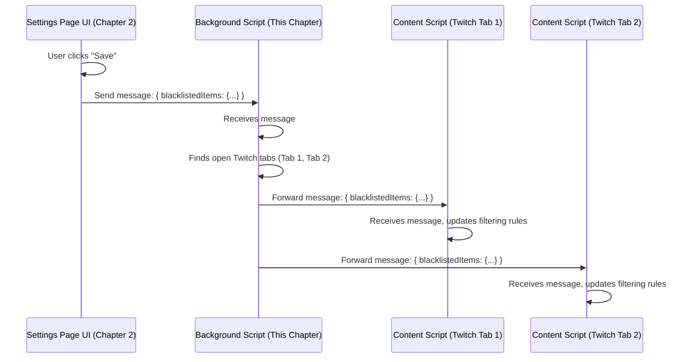

# Chapter 5: Background Event Handler & Message Router

Welcome back! In [Chapter 4: Blacklist Term Matching Logic](04_blacklist_term_matching_logic_.md), we figured out *how* the extension decides if a stream title or category matches your blacklist rules. But where does that checking happen? And how do different parts of the extension talk to each other? For example, how does clicking "Save" in the settings page instantly update the filtering on your open Twitch tabs?

We need a central coordinator, a part of the extension that's always running, listening for important events, and directing communication. This is the job of the **Background Event Handler & Message Router**.

## What is the Background Script? The Extension's Brain

Think of the background script (usually a file named something like `background.js`) as the extension's central nervous system or its air traffic controller. It's a special script that the browser runs constantly in the background, from the moment the extension is enabled until it's disabled or the browser closes. It doesn't have a visible page like the settings or the popup; it just works silently behind the scenes.

Its two main jobs are:

1.  **Listening for Browser Events:** It keeps an ear out for things happening in the browser, like when you navigate to a new page, update a tab, or install the extension.
2.  **Routing Messages:** It acts like a central post office or switchboard, receiving messages from one part of the extension (like the popup or settings page) and delivering them to the correct destination (like the scripts running on Twitch pages or handling the message itself).

Let's look at these two jobs using examples from UnwantedTwitch.

## Job 1: Listening to Browser Events - Controlling the Icon

**The Problem:** We only want the UnwantedTwitch icon in your browser toolbar to be clickable when you are actually on a Twitch page (`twitch.tv`). On other websites like Google or YouTube, the icon should be greyed out and inactive.

**The Solution:** The background script listens for the browser event that says "a tab has been updated". When this happens, it checks the URL of the updated tab.

```javascript
// Simplified from checkForSupportedURL in scripts/background.js

// Define the website we care about
const twitchUrl = 'https://www.twitch.tv/';

// This function runs whenever a tab is updated
async function handleTabUpdate(tabId, changeInfo, tab) {

  // Check if the tab has a URL and if it starts with 'https://www.twitch.tv/'
  if (tab && tab.url && tab.url.startsWith(twitchUrl)) {
    console.log(`Tab ${tabId} is a Twitch tab. Enabling icon.`);
    // Tell the browser to enable the icon for this specific tab
    await chrome.action.enable(tabId);
  } else {
    console.log(`Tab ${tabId} is NOT a Twitch tab. Disabling icon.`);
    // Tell the browser to disable (grey out) the icon for this tab
    await chrome.action.disable(tabId);
  }
}

// Tell the browser: "Hey, whenever a tab is updated, run our handleTabUpdate function"
chrome.tabs.onUpdated.addListener(handleTabUpdate);
```

**Explanation:**

1.  We store the beginning of the Twitch URL (`https://www.twitch.tv/`) in `twitchUrl`.
2.  The `handleTabUpdate` function gets information about the tab that was just updated.
3.  It checks if the tab's `url` exists and starts with `twitchUrl`.
4.  If it *is* a Twitch tab, it uses `chrome.action.enable(tabId)` to make the extension's icon active for that tab.
5.  If it's *not* a Twitch tab, it uses `chrome.action.disable(tabId)` to grey out the icon.
6.  The last line, `chrome.tabs.onUpdated.addListener(...)`, is crucial. It registers our `handleTabUpdate` function with the browser, ensuring it gets called automatically whenever *any* tab updates its URL or loading status.

This way, the background script constantly monitors your tabs and keeps the icon's status correct without you needing to do anything.

## Job 2: Routing Messages - Relaying Blacklist Updates

**The Problem:** You're on the [Settings Page Manager (Blacklist UI)](02_settings_page_manager__blacklist_ui_.md) and you just added "NoisyStreamer" to your channel blacklist and clicked "Save". The settings page knows about the change, but how do the *content scripts* (the parts of the extension actually hiding streams on your open Twitch tabs) find out about this new blacklist immediately?

**The Solution:** The settings page doesn't try to find and talk to every Twitch tab directly. That would be complicated! Instead, it sends a single message containing the updated blacklist to the background script. The background script then acts as a router, forwarding this message to all relevant content scripts running on open Twitch pages.

```javascript
// Simplified from the message listener in scripts/background.js

// Tell the browser: "Hey, whenever any part of the extension sends a message,
// run this function"
chrome.runtime.onMessage.addListener(async (message, sender, sendResponse) => {
  console.log("Background script received a message:", message);

  // Is this a special command for the background script itself?
  if (message && message.action === 'openBlacklist') {
    console.log("Action request: Opening blacklist page.");
    // Handle the action directly (e.g., open the settings page)
    await chrome.tabs.create({ url: '/views/blacklist.html' });

  // Is this a message that needs to be passed on?
  // Example: message might be { blacklistedItems: { channels: {...}, ... } }
  } else if (message && message.blacklistedItems) {
    console.log("Received blacklist update. Forwarding to Twitch tabs...");
    // Find all open tabs that are Twitch pages
    const twitchTabs = await chrome.tabs.query({ url: twitchUrl + '*' });
    // Forward the message to each of those tabs
    await forwardMessageToTabs(message, twitchTabs);

  } else {
    // Maybe handle other types of messages or commands...
    console.log("Received other message type, might forward or handle.", message);
    // Let's assume for simplicity we forward unknown messages too
    const allTabs = await chrome.tabs.query({ url: twitchUrl + '*' });
    await forwardMessageToTabs(message, allTabs);
  }

  // Important for async listeners
  return true;
});

// Helper function to send a message to a list of tabs
async function forwardMessageToTabs(message, tabs) {
  for (const tab of tabs) {
    try {
      // Send the *same message* we received to the content script in this tab
      await chrome.tabs.sendMessage(tab.id, message);
      console.log(`Forwarded message to tab ${tab.id}`);
    } catch (error) {
      // This might happen if the tab closed or the content script isn't ready
      console.warn(`Could not send message to tab ${tab.id}:`, error.message);
    }
  }
}
```

**Explanation:**

1.  `chrome.runtime.onMessage.addListener(...)` registers a function that runs every time `chrome.runtime.sendMessage(...)` is called from *anywhere* in the extension (like the settings page, popup, or even content scripts).
2.  Inside the listener, we first check if the `message` contains a specific `action` that the background script should handle itself (like opening the settings page).
3.  If it's not a direct action, we check if it looks like the blacklist update message (e.g., it has a `blacklistedItems` property).
4.  If it seems like a blacklist update (or another message to be forwarded), the script uses `chrome.tabs.query({ url: twitchUrl + '*' })` to get a list of all currently open tabs whose URL starts with `https://www.twitch.tv/`.
5.  It then calls the helper function `forwardMessageToTabs`.
6.  `forwardMessageToTabs` loops through the list of `twitchTabs`. For each tab, it uses `chrome.tabs.sendMessage(tab.id, message)` to send the *exact same message* it received on to the content script running within that specific tab.
7.  The content script on the Twitch page will have its *own* `chrome.runtime.onMessage.addListener` waiting to receive this forwarded message and update its filtering behavior accordingly.

This way, the background script acts as a central hub. The settings page sends one message, and the background script ensures all relevant parties get notified.

## How It Works: Visualizing Message Routing

Let's trace the flow when you save your blacklist:



This diagram shows the Settings Page sending a message to the Background script. The Background script doesn't need to know the details of the blacklist; its job is simply to identify the correct recipients (Content Scripts on Twitch tabs) and forward the message to them.

## Conclusion

The **Background Event Handler & Message Router** (`background.js`) is the unsung hero of the extension. It's the always-on central coordinator that:

1.  **Listens to browser events**, like tab updates, to perform actions like enabling or disabling the toolbar icon (`chrome.tabs.onUpdated`).
2.  **Acts as a message dispatcher** (`chrome.runtime.onMessage`), receiving messages from parts like the settings or popup and forwarding them to content scripts running on Twitch pages, ensuring everyone has the latest information.

It's the glue that holds the different parts of the extension together and allows them to react to events and communicate effectively. Without it, the extension would be a collection of disconnected parts.

Now that we understand how the background script coordinates things, how does the extension actually *store* your blacklist and settings so they aren't forgotten when you close the browser?

**Next:** [Chapter 6: Storage Abstraction & Mode Handling](06_storage_abstraction___mode_handling_.md) - Learn how the extension saves and retrieves your data persistently.

---

Generated by [AI Codebase Knowledge Builder](https://github.com/The-Pocket/Tutorial-Codebase-Knowledge)