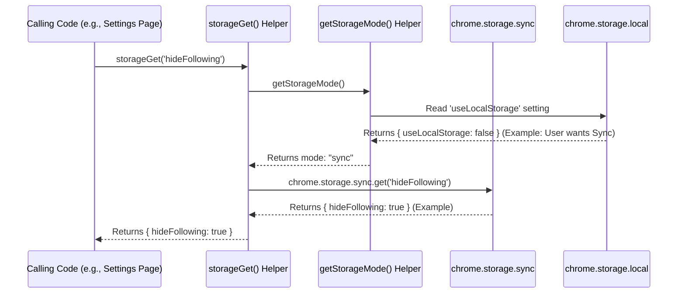

# Chapter 6: Storage Abstraction & Mode Handling

Welcome back! In [Chapter 5: Background Event Handler & Message Router](05_background_event_handler___message_router_.md), we saw how the background script acts as the extension's brain, listening for events and routing messages. We saw it receiving updates, like a new blacklist from the settings page. But where does that blacklist live permanently? How does the extension remember your preferences (like "ASMR" being blacklisted, or whether the extension is enabled) even after you close and reopen your browser?

We need a way to **store** data persistently. This chapter introduces how UnwantedTwitch handles saving and loading data, like your blacklist and settings, using a smart system called **Storage Abstraction & Mode Handling**.

## Why Do We Need to Store Data?

Imagine you spent time carefully adding channels and categories to your blacklist. If the extension forgot everything every time you closed your browser, it would be useless! We need a way to save your data so it's there the next time you use Twitch. This saving and loading process is called **persistent storage**.

## Where Can Browser Extensions Store Data?

Browser extensions have a couple of built-in storage options provided by the browser itself:

1.  **`chrome.storage.local` (Local Storage):**
    *   Think of this like a **large suitcase** stored on your computer.
    *   **Pros:** It has a relatively large storage capacity (usually several megabytes). Great for storing big lists.
    *   **Cons:** The data is *only* available on the specific computer where you saved it. If you use the same browser profile on another computer, the data won't be there.

2.  **`chrome.storage.sync` (Sync Storage):**
    *   Think of this like a **small backpack** that syncs using your browser account (like your Google or Firefox account).
    *   **Pros:** If you're logged into your browser account on multiple computers, the data saved here will automatically sync across them! Your blacklist on your desktop would appear on your laptop.
    *   **Cons:** It has a much **smaller storage capacity** (around 100 kilobytes total, with limits per item). It's also slightly slower because it involves syncing over the network.

**Which one should we use?** Users might prefer one over the other:
*   Someone who uses multiple devices might want the convenience of `sync`.
*   Someone with a *huge* blacklist might need the larger capacity of `local`.

## The Problem: Complexity and Choice

Writing code to handle both options everywhere can get messy. Imagine writing code like this every time you need to save something:

```javascript
// Messy way - DON'T DO THIS EVERYWHERE!
let userPrefersSync = checkUserPreference(); // How to check?
let dataToSave = { setting: 'value' };

if (userPrefersSync) {
  // Try saving to sync... but what if it's too big?
  chrome.storage.sync.set(dataToSave, () => {
    if (chrome.runtime.lastError) {
      // Sync failed! Maybe save to local instead? Or tell the user?
      console.error("Sync save failed:", chrome.runtime.lastError);
      // Fallback? chrome.storage.local.set(dataToSave);
    }
  });
} else {
  // Save to local
  chrome.storage.local.set(dataToSave);
}
```

This is complicated! We have to check the user's preference *and* potentially handle errors (especially the size limits of `sync`) every single time we save or load data.

## The Solution: Storage Abstraction - A Universal Adapter

To keep things simple and clean, UnwantedTwitch uses a **Storage Abstraction**. Think of it like a universal power adapter for your electronics when traveling. You don't need to worry if the wall socket in another country is different; you just plug your device into the adapter, and the adapter handles plugging into the wall.

Our storage abstraction provides simple functions that act as this adapter:

*   `storageGet(keys)`: Gets data. You just ask for what you need (e.g., `hideFollowing` setting).
*   `storageSet(data)`: Saves data. You just give it the data you want to save.
*   `storageRemove(keys)`: Removes data.

These functions *internally* figure out whether to use `sync` or `local` storage based on your preference. This preference is controlled by the "Use Sync Storage" checkbox you saw on the settings page ([Chapter 2: Settings Page Manager (Blacklist UI)](02_settings_page_manager__blacklist_ui__.md)).

The logic that decides *which* storage area (`sync` or `local`) to use based on the user's setting is called **Mode Handling**.

## How to Use the Abstraction

Using the abstraction is much simpler. These helper functions are defined in `scripts/common.js` and can be used anywhere in the extension.

**Example 1: Saving the `hideFollowing` Setting**

Remember the "Hide streams from followed channels" checkbox? When you click "Save" on the settings page, the code needs to save whether that box is checked.

```javascript
// Simplified from onSave() in scripts/blacklist.js

// Get the checkbox element from the page
const hideFollowingCheckbox = document.getElementById('hideFollowing');

async function saveHideFollowingSetting() {
  let isChecked = hideFollowingCheckbox.checked; // true or false

  console.log(`Saving hideFollowing setting: ${isChecked}`);

  // Use our universal adapter to save!
  // We don't care if it goes to sync or local here.
  await storageSet({ 'hideFollowing': isChecked });

  console.log("hideFollowing setting saved.");
}

// Assume this function is called when the user clicks Save
saveHideFollowingSetting();
```

*   **Input:** The state of the checkbox (`true` or `false`).
*   **Action:** `storageSet` is called with an object `{ 'hideFollowing': value }`.
*   **Output:** The `hideFollowing` setting is saved either to `chrome.storage.sync` or `chrome.storage.local`, depending on the user's preference (determined internally by `storageSet`).

**Example 2: Loading the `hideFollowing` Setting**

When the settings page opens, it needs to load the saved value to check or uncheck the box correctly.

```javascript
// Simplified from loadHideFollowing() in scripts/blacklist.js

// Get the checkbox element from the page
const hideFollowingCheckbox = document.getElementById('hideFollowing');

async function loadAndApplyHideFollowingSetting() {
  console.log("Loading hideFollowing setting...");

  // Use our universal adapter to get the value!
  // We ask for the 'hideFollowing' key.
  const result = await storageGet('hideFollowing');

  // result might be { hideFollowing: true } or { hideFollowing: false }
  // or {} if it was never saved.

  // Default to true if it's not explicitly false
  let settingValue = result.hideFollowing !== false;

  console.log(`Loaded hideFollowing setting: ${settingValue}`);

  // Update the checkbox on the page
  hideFollowingCheckbox.checked = settingValue;
}

// Call this when the settings page initializes
loadAndApplyHideFollowingSetting();
```

*   **Input:** A key name (`'hideFollowing'`).
*   **Action:** `storageGet` is called to retrieve the value associated with that key.
*   **Output:** The function returns an object containing the requested data (e.g., `{ hideFollowing: true }`). The code then uses this value to update the checkbox.

See how simple it is? We just use `storageSet` and `storageGet` without worrying about `sync` vs `local`.

## How It Works Under the Hood: Mode Handling

So, how do `storageGet` and `storageSet` know *where* to save or load from? They rely on another helper function called `getStorageMode()`, also in `scripts/common.js`.

**1. Checking the Mode (`getStorageMode`)**

This function's job is to determine if the user wants to use `sync` or `local`.

*   It checks a special setting named `useLocalStorage` which is *always* stored in `chrome.storage.local`. Why always local? Because the *choice* of storage needs to be consistently available on the specific computer, regardless of sync status.
*   If `useLocalStorage` is `true` (or not set), it means the user wants to use *local* storage.
*   If `useLocalStorage` is `false`, it means the user checked the "Use Sync Storage" box and wants to use *sync* storage.
*   It returns the string `"local"` or `"sync"`.

```javascript
// Simplified from getStorageMode() in scripts/common.js

async function getStorageMode() {
  console.log("Determining storage mode...");
  let useSyncStorage = false; // Default assumption

  try {
    // Always check the preference from LOCAL storage
    const result = await chrome.storage.local.get('useLocalStorage');

    // If 'useLocalStorage' is explicitly false, user wants sync
    if (result['useLocalStorage'] === false) {
      useSyncStorage = true;
    }
  } catch (error) {
    console.error("Error reading useLocalStorage setting:", error);
    // Stick to default (local) if there's an error
  }

  const mode = useSyncStorage ? 'sync' : 'local';
  console.log(`Storage mode determined: ${mode}`);
  return mode;
}
```

**2. Using the Mode (`storageGet` / `storageSet`)**

Now, let's look inside `storageGet` ( `storageSet` is very similar).

*   It first calls `getStorageMode()` to find out whether to use `"sync"` or `"local"`.
*   Based on the returned mode, it calls the *actual* browser storage function (`chrome.storage.sync.get` or `chrome.storage.local.get`).
*   It returns the result it gets from the browser API.

```javascript
// Simplified from storageGet() in scripts/common.js

async function storageGet(keys) {
  console.log(`storageGet called for keys:`, keys);

  // 1. Determine the mode
  const mode = await getStorageMode(); // Returns 'sync' or 'local'

  let result = {};
  try {
    // 2. Call the appropriate browser storage API
    console.log(`Accessing chrome.storage.${mode}.get...`);
    if (mode === 'sync') {
      result = await chrome.storage.sync.get(keys);
    } else {
      result = await chrome.storage.local.get(keys);
    }
    // Check for errors (simplified)
    if (chrome.runtime.lastError) throw chrome.runtime.lastError;

  } catch (error) {
    console.error(`Error reading from storage.${mode}:`, error);
  }

  console.log(`storageGet returning:`, result);
  // 3. Return the result
  return result;
}
```

Let's visualize the flow when `storageGet('hideFollowing')` is called:



This shows how the abstraction layer (`storageGet`, `getStorageMode`) directs the request to the correct underlying browser storage (`sync` or `local`) based on the user's preference.

## Handling Storage Limits (Especially for `sync`)

We mentioned that `chrome.storage.sync` has strict size limits. What happens if your blacklist becomes huge, maybe thousands of channels? Saving it as one big chunk might exceed the `sync` storage limit, causing an error.

Our storage abstraction needs to be aware of this. While `storageGet` and `storageSet` handle choosing the *mode*, they don't inherently solve the *size limit* problem for `sync`.

If the data you're trying to save with `storageSet` is too large *and* the current mode is `sync`, simply calling `chrome.storage.sync.set` might fail.

How does UnwantedTwitch handle this? By breaking large data (like the blacklist) into smaller pieces *before* saving it. This technique is called **fragmentation**.

## Conclusion

The **Storage Abstraction & Mode Handling** system provides a clean and simple way for different parts of the UnwantedTwitch extension to save and load data without getting bogged down in the details of `sync` vs `local` storage.

We learned:

*   Why persistent storage is necessary.
*   The difference between `chrome.storage.local` (big suitcase, local only) and `chrome.storage.sync` (small backpack, syncs across devices).
*   How the abstraction layer (`storageGet`, `storageSet`) acts like a universal adapter, simplifying saving and loading.
*   How **Mode Handling** (`getStorageMode`) checks the user's preference to decide whether to use `sync` or `local`.
*   That `sync` storage has size limits, which leads us to the next problem.

This abstraction makes the code much cleaner, but it doesn't fully solve the problem of large data in the limited `sync` storage. How do we fit a big blacklist into that small backpack?

**Next:** [Chapter 7: Storage Fragmentation Strategy](07_storage_fragmentation_strategy_.md) - Discover how UnwantedTwitch cleverly splits large data into smaller chunks to work around storage limits.

---

Generated by [AI Codebase Knowledge Builder](https://github.com/The-Pocket/Tutorial-Codebase-Knowledge)