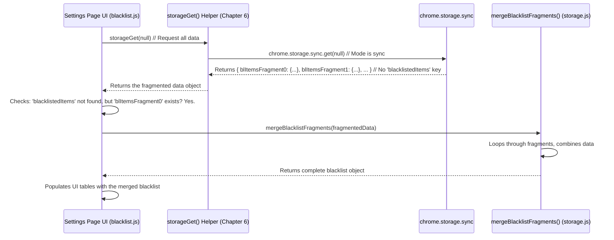

# Chapter 7: Storage Fragmentation Strategy

Welcome to the final chapter of the UnwantedTwitch tutorial! In [Chapter 6: Storage Abstraction & Mode Handling](06_storage_abstraction___mode_handling_.md), we learned how the extension uses a clever "universal adapter" (`storageGet` and `storageSet`) to save and load your settings, like the blacklist, without worrying too much about whether it's using the local "suitcase" (`chrome.storage.local`) or the syncing "backpack" (`chrome.storage.sync`).

We also learned that the syncing backpack (`sync` storage) is convenient because it keeps your settings consistent across different computers, but it has a big drawback: **it's small!** What happens if your blacklist grows really, really large?

## The Problem: Fitting Big Things in a Small Backpack

Imagine your blacklist has thousands of channels and keywords. You've chosen to use Sync Storage so your list stays the same on your laptop and desktop. But when you try to save this huge list, the extension tries to stuff it into the small `chrome.storage.sync` backpack... and it doesn't fit!

`chrome.storage.sync` has strict limits on how much data you can store in one go (around 8 Kilobytes per item) and how much you can store total (around 100 Kilobytes). A massive blacklist object might easily exceed the per-item limit. If this happens, the save operation simply fails, and your changes might be lost. How can we use the convenient sync feature even with a large blacklist?

## The Solution: Fragmentation - Using Smaller Boxes

Think about moving a very large, fragile item. You can't just put it in one huge box that violates shipping regulations. Instead, you carefully disassemble it or pack parts of it into several smaller, regulation-sized boxes. When it arrives, someone unpacks all the boxes and reassembles the item.

The **Storage Fragmentation Strategy** does exactly this for your blacklist data when using Sync Storage:

1.  **Splitting (Packing):** If the blacklist object is too large to fit in a single `sync` storage item, the extension automatically breaks it down into smaller pieces, called "fragments". Each fragment is small enough to fit within the size limits. Instead of saving one big `blacklistedItems` item, it saves several smaller items like `blItemsFragment0`, `blItemsFragment1`, `blItemsFragment2`, etc.
2.  **Merging (Unpacking):** When the extension needs to load your blacklist, it first checks if the single `blacklistedItems` item exists. If not, it looks for the fragments (`blItemsFragment0`, etc.). If it finds them, it fetches all the fragments and carefully pieces them back together into the complete blacklist object in memory.

This process happens automatically behind the scenes, mainly when you save or load your blacklist while Sync Storage mode is enabled.

## How Saving Works: Splitting the Blacklist

Let's peek into the logic that might run when you click "Save" on the settings page, specifically the part that saves the `blacklistedItems`. (Note: The actual implementation might slightly differ, but the concept is the same).

```javascript
// Conceptual idea of how storageSet might handle the blacklist

async function enhancedStorageSet(dataToSave) {
  // Check if we are trying to save the blacklist
  if (dataToSave.hasOwnProperty('blacklistedItems')) {
    let blacklist = dataToSave.blacklistedItems;

    // Check which storage mode we're using (sync or local)
    const mode = await getStorageMode(); // From Chapter 6

    // Is it too big for sync storage?
    const size = measureStoredSize(blacklist); // Check approximate size
    const isTooBigForSync = (mode === 'sync' && size > storageSyncMaxSize); // storageSyncMaxSize ~8KB

    if (isTooBigForSync) {
      console.log("Blacklist too large for sync, splitting into fragments...");
      // 1. Split the large blacklist into smaller fragment objects
      const fragments = splitBlacklistItems(blacklist); // Helper function does the splitting

      // 2. Remove the old (potentially large) single item if it exists
      await chrome.storage.sync.remove('blacklistedItems');
      //    (Also need to remove old fragments, simplified here)

      // 3. Save the new fragments
      await chrome.storage.sync.set(fragments); // Saves { blItemsFragment0:..., blItemsFragment1:... }
      console.log("Saved blacklist as fragments:", Object.keys(fragments));
      return; // We are done saving the fragmented blacklist
    } else {
      // Blacklist is small enough, or we are in local mode.
      // Make sure any old fragments are removed if we switch back to non-fragmented.
      await clearOldFragmentsIfNeeded();
      console.log("Saving blacklist as a single item.");
      // Save as a single item using the regular storageSet logic
    }
  }

  // Fallback to the original storageSet logic for other data or small blacklists
  await originalStorageSet(dataToSave); // Uses sync/local based on mode
}

// Helper function to split data (simplified from scripts/storage.js)
function splitBlacklistItems(items) {
  let fragments = {};
  let fragmentIndex = 0;
  // ... logic to divide items.categories, items.channels etc. ...
  // ... into fragments[ 'blItemsFragment' + fragmentIndex ] ...
  // ... ensuring each fragment is small enough ...
  fragments['blItemsFragment0'] = { categories: { /* first part */ }, channels: { /* first part */ } };
  fragments['blItemsFragment1'] = { categories: { /* second part */ } };
  // ... etc ...
  return fragments;
}

// Helper to estimate size (simplified)
function measureStoredSize(data) { return JSON.stringify(data).length; }

// Placeholder for the original function from Chapter 6
async function originalStorageSet(data) { /* ... uses getStorageMode ... */ }
async function clearOldFragmentsIfNeeded() { /* ... remove blItemsFragmentX ... */}
```

**Explanation:**

1.  When saving the `blacklistedItems`, the code first checks the storage `mode` (sync or local) and estimates the `size` of the blacklist.
2.  If the mode is `sync` *and* the size is too large (`isTooBigForSync`), it calls `splitBlacklistItems`.
3.  `splitBlacklistItems` takes the large blacklist and returns an object containing multiple smaller fragment objects (e.g., `{ blItemsFragment0: {...}, blItemsFragment1: {...} }`).
4.  The code then removes the old single `blacklistedItems` key from sync storage (and potentially any leftover fragments from a previous save).
5.  Finally, it saves the `fragments` object to `chrome.storage.sync`.
6.  If the blacklist is small enough, or if the mode is `local`, it proceeds to save it as a single item (using the logic from [Chapter 6: Storage Abstraction & Mode Handling](06_storage_abstraction___mode_handling_.md)) after ensuring old fragments are cleaned up.

This ensures that large blacklists are automatically fragmented *only* when needed (using sync storage).

## How Loading Works: Merging the Fragments

Now, how does the extension load the blacklist if it was saved in fragments? Let's look at the `loadBlacklistedItems` function in the settings page (`scripts/blacklist.js`), which uses `storageGet`.

```javascript
// Simplified from loadBlacklistedItems in scripts/blacklist.js

async function loadBlacklistedItems() {
  console.log("Loading blacklist items...");
  // Ask the storage system for ALL potentially relevant keys.
  // We ask for the main key AND potential fragment keys.
  const result = await storageGet(null); // 'null' gets everything

  let blacklistedItems = {}; // Start with an empty object

  // Did we get the data as a single object?
  if (typeof result.blacklistedItems === 'object') {
    console.log("Found single 'blacklistedItems' object.");
    blacklistedItems = result.blacklistedItems;

  // If not, did we get at least the first fragment?
  } else if (typeof result['blItemsFragment0'] === 'object') {
    console.log("Found fragments, merging them...");
    // Use a helper function to merge all fragments found in 'result'
    blacklistedItems = mergeBlacklistFragments(result);
    console.log("Fragments merged successfully.");

  } else {
    console.log("No blacklist data found (neither single object nor fragments).");
    // Leave blacklistedItems as empty {}
  }

  // Now display the loaded (or empty) blacklist in the UI tables
  console.log("Displaying loaded blacklist in UI...");
  addItems(categories_table_element, blacklistedItems.categories);
  addItems(channels_table_element, blacklistedItems.channels);
  // ... add tags and titles ...

  console.log("Blacklist loaded and displayed.");
}

// Helper function to merge fragments (simplified from scripts/storage.js)
function mergeBlacklistFragments(allStoredData) {
  let merged = { categories: {}, channels: {}, tags: {}, titles: [] };
  // Loop through possible fragment keys (blItemsFragment0, blItemsFragment1, ...)
  for (let i = 0; i < storageMaxFragments; i++) { // storageMaxFragments ~100
    let key = 'blItemsFragment' + i;
    if (allStoredData[key]) {
      let fragment = allStoredData[key];
      // Combine data from this fragment into the 'merged' object
      // ... merge fragment.categories into merged.categories ...
      // ... merge fragment.channels into merged.channels ...
      // ... etc ...
    } else {
      break; // Stop if we don't find the next fragment key
    }
  }
  return merged;
}

// Assume categories_table_element etc. are defined
// Call the function to load data
loadBlacklistedItems();
```

**Explanation:**

1.  `loadBlacklistedItems` calls `storageGet(null)` to fetch *all* data from the chosen storage area (sync or local).
2.  It first checks if the result contains the single `blacklistedItems` object. If yes, it uses that directly.
3.  If `blacklistedItems` is not found, it checks if the *first* fragment key (`blItemsFragment0`) exists.
4.  If fragments are detected, it calls the helper function `mergeBlacklistFragments`, passing it *all* the data retrieved from storage (`result`).
5.  `mergeBlacklistFragments` loops through potential fragment keys (`blItemsFragment0`, `blItemsFragment1`, ...), extracts the data from each existing fragment, and combines it into a single, complete `blacklistedItems` object.
6.  Finally, the code uses the fully assembled `blacklistedItems` object (whether it came from a single key or merged fragments) to populate the UI tables.

This loading logic ensures that the rest of the settings page code doesn't need to care whether the data was stored as one piece or many fragments – it always receives a complete `blacklistedItems` object.

## Internal Flow: Loading Fragmented Data

Let's visualize the process when the Settings Page loads a blacklist that was previously saved as fragments in Sync Storage:



This diagram shows how the Settings Page uses `storageGet` to fetch data. When it receives fragments instead of a single object, it calls `mergeBlacklistFragments` to reconstruct the full blacklist before proceeding.

## Conclusion

The **Storage Fragmentation Strategy** is a clever workaround for the size limitations of `chrome.storage.sync`. It allows UnwantedTwitch users to benefit from synchronized settings across devices, even if they have very large blacklists.

We learned:

*   **Why it's needed:** To overcome the small size limits of `sync` storage for large data like the blacklist.
*   **How it works:** Automatically splitting (fragmenting) the large blacklist into smaller pieces before saving to `sync` storage, and merging them back together when loading.
*   **Key Functions:** `splitBlacklistItems` handles the splitting, and `mergeBlacklistFragments` handles the merging, working alongside the `storageSet` and `storageGet` abstraction.
*   **Transparency:** For the most part, this happens behind the scenes, ensuring other parts of the extension can work with the blacklist data normally.

This strategy ensures the extension remains robust and flexible, adapting to different user needs and data sizes.

---

And that concludes our tour through the core components of UnwantedTwitch! We hope this journey, from the basic [Blacklist Data Model](01_blacklist_data_model_.md) to the intricacies of the [Storage Fragmentation Strategy](07_storage_fragmentation_strategy_.md), has given you a clear understanding of how this extension works under the hood. Happy browsing!

---

Generated by [AI Codebase Knowledge Builder](https://github.com/The-Pocket/Tutorial-Codebase-Knowledge)