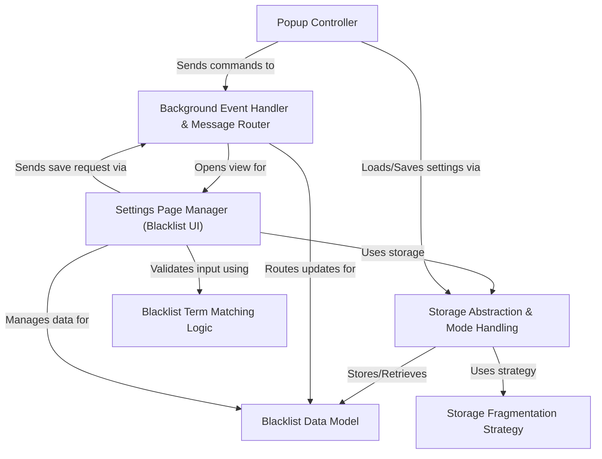

# Tutorial: master

This project is a **browser extension** designed for *Twitch* users.
It allows you to create and manage a **blacklist** of categories, channels, tags, or title keywords you don't want to see.
The extension then automatically *hides* content matching your blacklist while you browse Twitch, providing a cleaner viewing experience based on your preferences.

**Source Repository:** [https://github.com/kwaschny/unwanted-twitch/tree/master](https://github.com/kwaschny/unwanted-twitch/tree/master)

## Chapters

1. [Blacklist Data Model
](01_blacklist_data_model_.md)
2. [Settings Page Manager (Blacklist UI)
](02_settings_page_manager__blacklist_ui__.md)
3. [Popup Controller
](03_popup_controller_.md)
4. [Blacklist Term Matching Logic
](04_blacklist_term_matching_logic_.md)
5. [Background Event Handler & Message Router
](05_background_event_handler___message_router_.md)
6. [Storage Abstraction & Mode Handling
](06_storage_abstraction___mode_handling_.md)
7. [Storage Fragmentation Strategy
](07_storage_fragmentation_strategy_.md)

---

Generated by [AI Codebase Knowledge Builder](https://github.com/The-Pocket/Tutorial-Codebase-Knowledge)